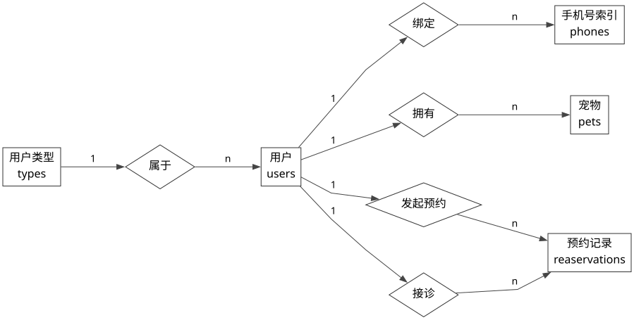
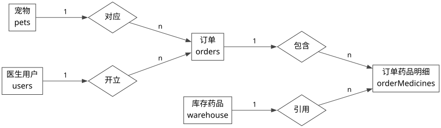
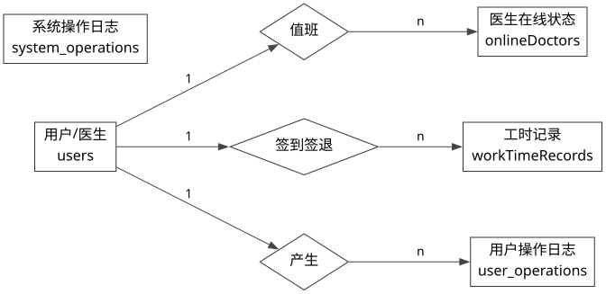

# 3.3 接口设计

接口设计主要包括外部第三方接口设计和内部接口设计两部分内容。结合本系统当前实现，外部接口主要用于短信验证码发送，内部接口主要用于前后端之间的验证码校验、账号唯一性校验等业务处理。

## 3.3.1 外部接口设计

本系统在用户手机号注册与短信验证码发送过程中调用了阿里云短信验证码服务。需要说明的是，系统并非直接手写 HTTP 请求调用阿里云接口，而是由后端 `authHandler` 调用 Python 脚本 `SendSmsVerifyCode.py`，再由该脚本基于阿里云 SDK 调用短信验证服务接口完成验证码发送。该设计方式将业务控制逻辑与第三方 SDK 调用逻辑进行了分离，便于后续维护与扩展。

表 3-1 外部接口清单如表所示。

| 接口名称 | 输入参数及其含义 | 返回值及其含义 |
| --- | --- | --- |
| 阿里云短信验证码发送接口 `dypnsapi.aliyuncs.com` | `phone_number`：接收验证码的手机号码；`verify_code`：系统生成的验证码；`sign_name`：短信签名；`template_code`：短信模板编号；`template_param`：模板参数；`country_code`：国家区号；`interval`：发送间隔限制；`valid_time`：验证码有效时长 | `success`：是否发送成功；`message`：返回消息；`request_id`：本次请求标识；`code`：阿里云返回状态码 |

从系统实现过程来看，外部短信接口的调用过程如下：

（1）用户在前端注册页面输入手机号，请求获取短信验证码。  

（2）前端将手机号提交至后端内部接口 `/api/verification/sms/send`。  

（3）后端首先校验手机号格式，并检查该手机号是否已经在 `users` 表中存在。  

（4）若手机号未注册，则后端调用验证码生成逻辑，生成 6 位随机验证码，并在内存验证码存储区中保存验证码及其创建时间。  

（5）后端随后通过 `executePythonScript` 调用 Python 脚本 `SendSmsVerifyCode.py`，并将手机号与验证码作为参数传入。  

（6）Python 脚本内部读取阿里云短信签名、模板编号等环境变量配置，构造 `SendSmsVerifyCodeRequest` 请求对象。  

（7）脚本通过阿里云 SDK 客户端向 `dypnsapi.aliyuncs.com` 发起验证码发送请求，并获得返回结果。  

（8）短信发送成功后，脚本返回发送结果给后端，后端再将“验证码已发送到手机”的结果返回前端；若发送失败，则返回失败信息并提示用户重试。  

通过该设计，系统实现了“后端业务控制 + Python 脚本调用 SDK + 阿里云短信发送”的外部接口调用链路，既能够满足验证码发送需求，也能够降低第三方接口调用代码与核心业务代码的耦合程度。

## 3.3.2 内部接口设计

内部接口主要用于前端与后端之间的业务通信，尤其是注册、登录、验证码发送与验证码校验等流程。结合当前系统实现，本系统内部接口主要包括手机号唯一性校验、邮箱唯一性校验、用户名唯一性校验、短信验证码发送接口和短信验证码校验接口等。

表 3-2 内部接口清单如下。

| 接口名称 | 输入参数及其含义 | 返回值及其含义 |
| --- | --- | --- |
| `POST /api/auth/checkName` | `name`：待校验的用户名 | `success`：是否成功；`message`：用户名是否可用；`code`：业务状态码 |
| `POST /api/auth/checkEmail` | `email`：待校验的邮箱地址 | `success`：是否成功；`message`：邮箱是否可用；`code`：业务状态码 |
| `POST /api/auth/checkPhone` | `phone`：待校验的手机号码 | `success`：是否成功；`message`：手机号是否可用；`code`：业务状态码 |
| `POST /api/verification/sms/send` | `phone`：需要接收验证码的手机号 | `data`：发送结果布尔值；`message`：发送状态说明；`phone`：发送目标手机号 |
| `POST /api/verification/sms/verify` | `phone`：手机号；`code`：短信验证码 | `token`：验证成功后签发的登录令牌；`success`：是否成功；`message`：校验结果说明 |

其中，短信验证码获取接口的业务处理过程如下：

（1）前端注册页面输入手机号后，调用 `POST /api/verification/sms/send` 接口发送验证码请求。  

（2）后端接收到请求后，首先检查请求体中是否包含 `phone` 字段，并验证手机号格式是否合法。  

（3）系统通过查询 `users` 表判断该手机号是否已经注册；若已注册，则直接返回失败结果。  

（4）若手机号未注册，则系统生成随机验证码，并使用验证码管理模块保存验证码及其创建时间。  

（5）系统异步调用 Python 脚本，通过阿里云短信服务向指定手机号发送验证码。  

（6）若发送成功，则返回统一 JSON 响应，响应中包含 `data=true` 与“验证码已发送到手机”的提示信息；若发送失败，则返回错误原因。  

短信验证码校验接口的处理过程如下：

（1）用户在注册页面输入收到的短信验证码后，调用 `POST /api/verification/sms/verify` 接口提交验证请求。  

（2）后端接收到请求后，检查请求体中是否包含手机号和验证码。  

（3）系统调用验证码验证逻辑，对验证码是否存在、是否匹配以及是否过期进行校验。  

（4）若验证码有效，则系统根据手机号查询用户信息，并根据手机号签发登录令牌；若验证码无效，则返回验证码校验失败结果。  

（5）前端根据返回结果决定后续页面跳转或错误提示。  

除短信相关接口外，用户名、邮箱和手机号唯一性校验接口均采用“前端输入参数 -> 后端校验格式 -> 数据库查询 -> 返回可用性结果”的方式实现，为用户注册提供了必要的前置校验支持。

# 3.4 数据库设计

数据库设计是系统实现的重要基础。通过对系统业务进行分析，可以将系统数据划分为用户信息、手机号信息、宠物信息、预约信息、订单信息、订单药品明细、库存信息、医生在线状态、工时记录以及操作审计等若干实体。各实体之间通过主键与外键建立联系，从而形成较为完整的数据存储结构。为了更直观地说明实体之间的关系，本文采用 E-R 图对数据库进行建模。

## 3.4.1 实体关系图（ER 图）

结合系统当前数据库实现，主要实体包括：

（1）`types`：用于存储用户类型信息，包括管理员、医生和普通用户等角色定义。  

（2）`users`：用于存储系统用户、医生和管理员的基础信息，包括姓名、密码、手机号、邮箱、生日、头像、等级等内容，是系统的核心实体之一。  

（3）`phones`：用于存储用户手机号信息及手机号尾号索引信息，通过 `user_id` 与 `users` 表关联，便于实现手机号精确检索和后四位检索。  

（4）`pets`：用于存储宠物基本信息，包括宠物名称、类型、年龄和性别等，通过 `user_id` 与用户信息关联。  

（5）`reaservations`：用于存储预约记录，记录预约用户、接诊医生、预约日期、时间段和预约状态等信息。  

（6）`orders`：用于存储诊疗订单信息，包括订单类型、订单说明、订单状态、订单总价等，并通过外键分别关联宠物与医生。  

（7）`orderMedicines`：用于存储订单与药品之间的明细关系，记录每个订单中包含的药品、数量、单价与总价。  

（8）`warehouse`：用于存储药品和库存信息，包括药品名称、类别、生产日期、有效期、价格、库存数量及总价等。  

（9）`onlineDoctors`：用于存储医生当天的在线排班状态，包括日期、签到时间、签退时间及当前状态。  

（10）`workTimeRecords`：用于存储医生签到签退及审批记录，便于管理端进行工时审查。  

（11）`user_operations`：用于记录用户相关操作日志。  

（12）`system_operations`：用于记录系统级操作日志。  

为了避免单张图内容过于复杂，本文将实体关系图拆分为 3 张分模块 E-R 图，分别描述用户与预约关系、订单与库存关系、医生排班与审计关系。为了突出主要实体之间的业务联系，图中不再展开绘制实体属性，仅保留实体与实体之间的关系。

### （一）用户与预约实体关系说明

在用户与预约子系统中，`types` 与 `users` 之间构成一对多关系，即一种用户类型可以对应多个用户；`users` 与 `phones` 之间通过 `user_id` 形成关联，用于扩展手机号存储与索引功能；`users` 与 `pets` 之间构成一对多关系，即一个用户可以拥有多只宠物；`reaservations` 同时关联预约用户和医生用户，因此分别通过 `user_id` 和 `doctor_id` 指向 `users` 表。该部分实体关系如图 3-5 所示。

### （二）订单与库存实体关系说明

在订单与库存子系统中，`orders` 通过 `pet_id` 关联宠物信息，通过 `doctor_id` 关联医生用户信息；`orderMedicines` 作为订单与药品之间的中间明细实体，一方面关联 `orders`，另一方面关联 `warehouse`。因此，一个订单可以对应多条药品明细记录，一种药品也可以出现在多个订单中。该部分实体关系如图 3-6 所示。

### （三）医生排班与审计实体关系说明

在医生排班与审计子系统中，`onlineDoctors` 用于维护医生在线状态，与 `users` 中的医生用户形成关联；`workTimeRecords` 用于记录医生上下班及审批情况，也通过 `doctor_id` 与医生用户关联；`user_operations` 用于记录用户维度操作行为，通过 `user_id` 关联用户实体；`system_operations` 用于记录系统级别操作，不直接依赖具体用户实体。该部分实体关系如图 3-7 所示。

综上所述，本系统数据库设计能够较好地支撑用户注册登录、预约管理、订单处理、库存管理以及医生排班等核心业务需求，并通过外键约束和关系拆分实现了数据结构的规范化与可维护性。
