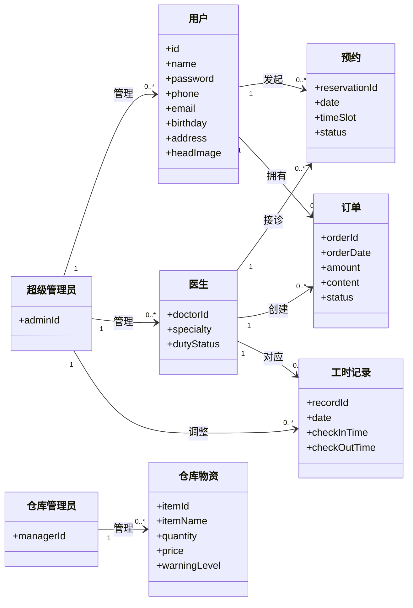
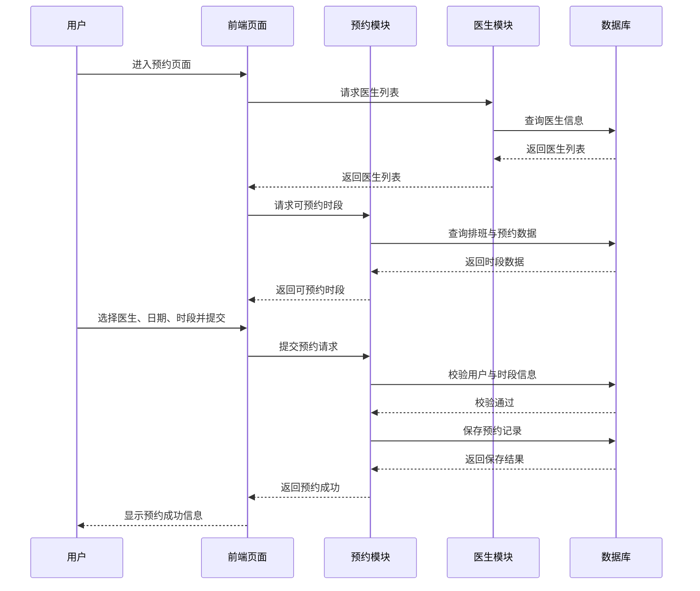

# 2.4 需求分析

本系统采用面向对象方法进行需求分析。从业务对象角度出发，识别系统中的核心概念类，建立概念类图，表达软件系统由哪些主要业务对象构成及其相互关系；同时，通过交互图描述用户与系统之间的主要交互过程，进一步明确系统功能需求和业务流程。

## 2.4.1 概念类分析

结合本项目“宠物医院管理系统”的业务功能，可以识别出以下核心概念类：

1. 用户：表示系统中的普通用户，主要属性包括用户编号、用户名、密码、手机号、邮箱、生日、地址、头像等。
2. 医生：医生可以看作用户的一种特殊角色，除具备基本用户信息外，还包含专业方向、出诊状态、上下班时间等信息。
3. 管理员：管理员负责系统后台管理，可进一步分为超级管理员和仓库管理员。
4. 预约：表示用户发起的预约记录，主要包含预约编号、预约日期、预约时段、预约状态、所属用户、所属医生等信息。
5. 订单：表示医生为用户创建的诊疗订单，主要包含订单编号、订单时间、订单金额、诊疗内容、订单状态、所属用户、所属医生等信息。
6. 仓库物资：表示仓库中的药品或医疗物资，主要包含物资编号、物资名称、数量、单价、预警值等信息。
7. 工时记录：表示医生每日签到、签退及上下班时间记录，主要用于后台管理和出诊状态维护。

这些核心概念类之间的主要关系如下：

- 一个用户可以对应多个预约记录。
- 一个医生可以对应多个预约记录。
- 一个用户可以拥有多个订单。
- 一个医生可以创建多个订单。
- 一个医生可以对应多个工时记录。
- 仓库管理员负责维护多个仓库物资信息。
- 超级管理员负责管理用户、医生权限和工时记录。

### 概念类图

## 2.4.2 交互分析

为了进一步明确用户与系统之间的交互过程，可选取系统中的核心业务流程建立交互图。结合本项目，典型交互过程包括：

1. 用户注册交互过程：用户进入注册页面，填写注册信息并提交；系统对用户名、手机号、邮箱和验证码进行校验；校验通过后保存用户信息并反馈注册成功。
2. 用户预约交互过程：用户进入预约页面，系统展示医生列表和可预约时段；用户选择医生和时间后提交预约申请；系统校验预约信息并生成预约记录，最后返回预约结果。
3. 医生创建订单交互过程：医生查看用户信息后填写诊疗内容并提交；系统对订单内容进行校验，生成订单记录并保存，最后返回创建成功信息。

### 用户预约交互图

## 2.4.3 本系统需求分析方法说明

本系统在需求分析阶段采用面向对象方法，原因如下：

- 系统中存在较明确的业务对象，如用户、医生、预约、订单、仓库物资等，适合用概念类进行建模。
- 系统强调多角色之间的交互关系，适合通过交互图描述业务流程。
- 面向对象分析结果能够更自然地过渡到后续的类设计、数据库设计和模块划分。

因此，本文采用概念类图和交互图相结合的方式，对宠物医院管理系统进行需求分析。
